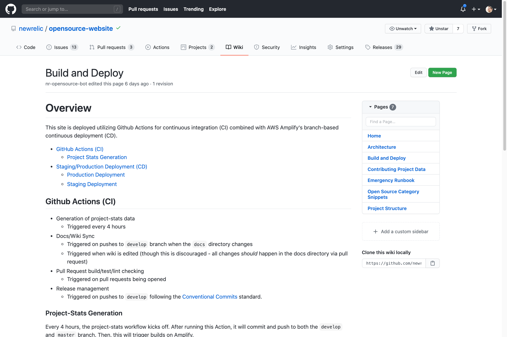

[](https://opensource.newrelic.com/oss-category/#community-project)

# Bi-directional Wiki Sync Action

[](https://github.com/marketplace/actions/wiki-sync-action)

A GitHub Action that synchronizes the contents of a directory to the repository's Wiki.

This project is a fork of [SwiftDocOrg/github-wiki-publish-action](https://github.com/SwiftDocOrg/github-wiki-publish-action) and attribution is noted in the [THIRD_PARTY_NOTICES.md](./THIRD_PARTY_NOTICES.md). The basic enhancement is this adds syncronization so edits made directly to the Wiki can flow back to the repo directory.

> Note: This "sync" only works for create/update of a file in the wiki. Deletes will not propogate back due to limitations of the GitHub API gollum event. For deletes, remove the file from the directory and the directory -> wiki sync will remove the file.

## Inputs

| Key              | Required | Default                                               | Description                                                                |
| ---------------- | -------- | ----------------------------------------------------- | -------------------------------------------------------------------------- |
| `source`         | yes      | -                                                     | Source directory/location of file sync (ex: `docs`).                       |
| `destination`    | yes      | -                                                     | Destination directory/location for file sync (ex: `wiki`).                 |
| `token`          | yes      | -                                                     | Github personal access token with at least 'repo' authorization.           |
| `gitAuthorName`  | no       | `github.actor`                                        | Author name to use for committing to repository.                           |
| `gitAuthorEmail` | no       | `github.actor@users.noreply.github.com`               | Author name to use for committing to repository.                           |
| `branch`         | no       | `master`                                              | Default branch to commit to. Only needed when syncing wiki to a directory. |
| `commitMessage`  | no       | `chore(docs): Sync $SOURCE to $DESTINATION [skip-cd]` | Message for committing files to repository.                                |

## Example Usage

This Action is utilized by opensource.newrelic.com to keep our [docs](https://github.com/newrelic/opensource-website/tree/develop/docs) and [Wiki](https://github.com/newrelic/opensource-website/wiki) in sync. To see the implementation, visit [newrelic/opensource-website](https://github.com/newrelic/opensource-website/blob/develop/.github/workflows/docs.yml).

**Wiki**:


**Workflows**:


### Bi-directional Sync Workflow

The following example shows how to use the `wiki-sync-action` in conjunction with the `gollum` event.

> NOTE: Either `source` or `destination` _must_ be set to `wiki`. The action will error out if an attempt is made to not sync a directory with the wiki.

```yaml
name: Documentation

on:
  push:
    branches:
      - develop
    paths:
      - "docs/**"
  repository_dispatch:
    types: [docs]
  gollum:

env:
  GIT_AUTHOR_NAME: Actionbot
  GIT_AUTHOR_EMAIL: actions@github.com

jobs:
  job-sync-docs-to-wiki:
    runs-on: ubuntu-latest
    if: github.event_name != 'gollum'
    steps:
      - name: Checkout Repo
        uses: actions/checkout@v2
      - name: Sync docs to wiki
        uses: newrelic/wiki-sync-action@master
        with:
          source: docs
          destination: wiki
          token: ${{ secrets.NEWRELIC_BOT_TOKEN }}
          gitAuthorName: ${{ env.GIT_AUTHOR_NAME }}
          gitAuthorEmail: ${{ env.GIT_AUTHOR_EMAIL }}
  
  job-sync-wiki-to-docs:
    runs-on: ubuntu-latest
    if: github.event_name == 'gollum'
    steps:
      - name: Checkout Repo
        uses: actions/checkout@v2
        with:
          token: ${{ secrets.NEWRELIC_BOT_TOKEN }} # allows us to push back to repo
          ref: develop
      - name: Sync Wiki to Docs
        uses: newrelic/wiki-sync-action@master
        with:
          source: wiki
          destination: docs
          token: ${{ secrets.NEWRELIC_BOT_TOKEN }}
          gitAuthorName: ${{ env.GIT_AUTHOR_NAME }}
          gitAuthorEmail: ${{ env.GIT_AUTHOR_EMAIL }}
          branch: develop # since default branch is develop in this example
```

## Support

New Relic hosts and moderates an online forum where customers can interact with New Relic employees as well as other customers to get help and share best practices. Like all official New Relic open source projects, there's a related Community topic in the New Relic Explorers Hub. You can find this project's topic/threads here:

[https://discuss.newrelic.com/t/open-source-maintainers-keep-repo-documentation-in-sync-with-the-bi-directional-wiki-sync-github-action/105611](https://discuss.newrelic.com/t/open-source-maintainers-keep-repo-documentation-in-sync-with-the-bi-directional-wiki-sync-github-action/105611)

## Contributing

Contributions are encouraged! If you submit an enhancement request, we'll invite you to contribute the change yourself. Please review our [Contributors Guide](CONTRIBUTING.md).

Keep in mind that when you submit your pull request, you'll need to sign the CLA via the click-through using CLA-Assistant. If you'd like to execute our corporate CLA, or if you have any questions, please drop us an email at opensource+wiki-sync-action@newrelic.com.

## License

Wiki Sync Action is licensed under the [Apache 2.0](http://apache.org/licenses/LICENSE-2.0.txt) License.
>The wiki-sync-action also uses source code from third party libraries. Full details on which libraries are used and the terms under which they are licensed can be found in the third party notices document.
